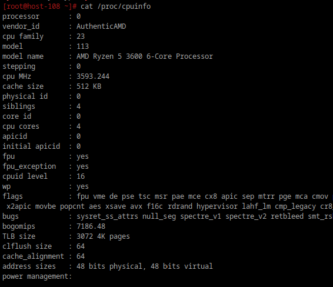

**1) Какие файловые системы вы знаете?**

    - ext, ext2, ext3, ext4 (Linux) - расширенная файловая система, одна из первых, четвертая версия сейчас по умолчанию входит в большинство дистрибутивов.
    - Btrfs (Linux) - отличается повышенной стойкостью к отказам и высокой производительностью.
    - XFS (Linux) - еще одна из журналируемых ФС, оптимизирована для работы с большими файлами.
    - OpenZFS (Linux) - отличается высоким уровнем защиты от повреждения информации, автоматическим восстановлением, поддержкой больших объемов данных. 
    - NTFS (Windows) - основная файловая система для Windows, поддерживающая большие объемы данных и функции безопасности.
    - FAT32 (Windows) - широко используется на съемных носителях благодаря своей высокой совместимости с различными устройствами и операционными системами.
    - HFS+ и APFS (macOS) - используются в устройствах Apple. APFS является более новой системой, которая предлагает улучшенную производительность и безопасность.
**2) Как можно классифиировать файловые системы? в чём отличия??**

  - По журналируемости:
    - Журналируемые. Сохраняет историю манипуляций пользователя и позволяет ее посмотреть, выполнить диагностику системы в отдельном специальном файле. Отличается повышенной стойкостью к сбоям в функционировании, сохранностью целостности данных. 
    - Не журналируемые. Здесь не предусмотрено сбережение логов, нет гарантий сохранности информации.  

  - По функционалу
    - Специальные (procfs, sysfs и т.д.) — предоставляют интерфейсы к ядру ОС.
    - Пользовательские (ext4, btrfs и т.д.) — для хранения данных пользователей.
  
**3) Какие файловые системы используются в linux?**

В Linux используется широкий спектр файловых систем, каждая из которых имеет свои особенности и применяется в зависимости от конкретных задач. Вот наиболее популярные файловые системы:

1. EXT (Extended Filesystem)
EXT: Одна из первых файловых систем, разработанных для операционной системы Linux. Она была создана в 1992 году как улучшенная версия более ранней файловой системы MINIX. EXT стала первой файловой системой, специально разработанной для Linux. Сейчас используется крайне редко.
EXT2: Файловая система, разработанная для Linux. Создана как улучшенная версия более ранней файловой системы EXT. использует структуру файловой системы, основанную на блоках и индексных дескрипторах (inodes), содержащих метаданные; нежурналируемая; ограничена в размерах; подвержена фрагментации
EXT3: В отличие от предыдущей версии является журналироемой, что уменьшает вероятность повреждения данных. Максимальный размер ФС, в отличие от EXT2(4TB), 16TB 
EXT4: Современная ФС, в которой сведены к минимуму присутствующие ранее изъяны, максимальный размер ФС - 1EB, поддерживает расширенные атрибуты файлов, такие как права доступа, владелец файла, временные метки, поддерживает создание снимков файловой системы, что позволяет сохранять ее состояние в определенный момент времени, из минусов можно выделить не решенную до конца проблему фрагментации, тем не менее, она широко используется в различных дистрибутивах Linux. 
2. XFS
Высокопроизводительная журнальная файловая система, оптимизированная для работы с большими файлами.
Часто используется в серверах и системах хранения данных. Отличительная особенность: в логи программа будет записывать только изменения в метаданных.
Позволяет увеличивать размеры разделов, но не уменьшать и удалять.
3. Btrfs (B-Tree File System)
Журналируемая ФС, разработана для управления большими объемами данных, широко используется в настоящий момент.
Поддерживает создание снимков ФС, копий, дедупликацию, компрессию, различные уровни RAID (RAID 0, RAID 1, RAID 10, RAID 5, RAID 6), использует динамическое распределение блоков
Используется в системах, где важна надежность и функциональность (например, openSUSE, Fedora, Synology NAS).Размеры разделов можно менять в рабочем процессе.
4. ReiserFS
Была одной из первых журналируемых файловых систем. Оптимизирована для работы с большим количеством мелких файлов. Она использует балансированные деревья (B-trees) для хранения метаданных, что позволяет быстро находить и обновлять информацию о файлах.
Уступила свое место более новым ФС
5. ZFS
Высокопроизводительная и надежная файловая система, разработанная компанией Sun Microsystems(2005). Стала популярной благодаря своим уникальным возможностям и характеристикам. Поддерживается на различных ОС, включая Solaris, FreeBSD, Linux и другие.
Поддерживает те же функции, что и Btrfs (B-Tree File System), дополнительно использует контрольные суммы для всех данных и метаданных, что позволяет обнаруживать и исправлять ошибки данных, поддерживает собственные реализации RAID, такие как RAID-Z, которые обеспечивают высокую надежность и производительность.
Используется в системах хранения данных (например, в серверах FreeNAS и TrueNAS).
6. F2FS (Flash-Friendly File System)
Файловая система, разработанная Samsung специально для использования на флэш-памяти, такой как SSD (твердотельные накопители) и eMMC (встроенные многочиповые модули).
Использует логарифмическую структуру для хранения данных, что позволяет минимизировать фрагментацию и улучшить производительность при записи и чтении данных. Поддерживает команду TRIM, которая позволяет операционной системе уведомлять SSD о том, какие блоки данных больше не используются.
F2FS широко используется в мобильных устройствах и серверах, где требуется высокая надежность и производительность.
7. Swap
   это область на диске, используемая операционной системой для временного хранения данных, которые не могут быть сохранены в оперативной памяти (RAM). Swap позволяет системе эффективно управлять памятью и предотвращать переполнение оперативной памяти.
Является частью виртуальной памяти, которая позволяет системе использовать дисковое пространство как расширение оперативной памяти.
8. VFAT и ExFAT
Файловые системы, разработанные Microsoft для использования на различных носителях, таких как флэш-накопители, карты памяти и внешние жесткие диски.
VFAT: Совместима с большинством операционных систем, включая Windows, macOS и Linux. Имеет простую структуру и легко настраивается, что делает её подходящей для использования на флэш-накопителях и картах памяти. Основной минус - ограничения размерности
ExFAT: Поддерживает большие файлы размером до 16 эксабайт (EB) и файловые системы размером до 128 петабайт (PB), часто используется для флеш-накопителей, совместимых с Windows и macOS, требует установки дополнительных пакетов для поддержки в Linux.
9. NTFS
Высокопроизводительная и надежная файловая система, разработанная Microsoft для операционных систем Windows, поддерживается в Linux с помощью драйвера ntfs-3g.
Как особенность можно выделить поддержку встроенной компрессии данных, что позволяет экономить дисковое пространство. Также поддерживается шифрование файлов и папок с использованием EFS (Encrypting File System).
NTFS является стандартной ФС для всех современных версий Windows, включая Windows 10 и Windows 11.
10. Other Specialized File Systems
ISO 9660: Международный стандарт для ФС, используемой на оптических дисках, таких как CD-ROM, DVD-ROM и Blu-ray; совместима с разными ОС, имеет простую структуру и легко настраивается.
SquashFS: Широко используется в различных дистрибутивах Linux для создания Live CD, Live USB и других типов установочных носителей. Не поддерживает запись данных. Надежная, эффективно использует память.
CephFS, GlusterFS: Для распределенных файловых систем. CephFS является частью унифицированной системы хранения Ceph и обеспечивает высокую надежность и отказоустойчивость. GlusterFS использует архитектуру "scale-out" и обеспечивает высокую производительность и простоту настройки.
Tmpfs: Используется для временного хранения данных в оперативной памяти, во избежании переполнения ОП использует свопинг(swap space), поддерживает стандартные операции файловой системы(создание, чтение, запись, удаление).

Выбор файловой системы

Если нужна высокая скорость чтения и записи, то стоит использовать EXT4, XFS или Btrfs для Linux, или NTFS для Windows. 
Для параллельных операций ввода-вывода - XFS или ZFS.
Для флэш-памяти и SSD - F2FS или EXT4 с оптимизацией для SSD.
Для временного хранения данных - Tmpfs
Для распределенных систем - CephFS или GlusterFS.
Для поддержки больших файловых систем - ZFS, XFS или Btrfs.

**4) Как можно создать файловую систему на диске?**

Для создания файловой системы используется команда mkfs. Например, чтобы создать файловую систему ext4 на /dev/sdb1:
```
mkfs -t ext4 /dev/sdb1
или
mkfs.ext4 /dev/sdb1
```

**5) Как можно подключить диск в систему, что такое монтирование?**

Монтирование — это процесс подключения файловой системы устройства (например, жесткого диска, флешки или сетевого ресурса) к определенной точке файловой системы Linux, называемой точкой монтирования.
```
монтирование : sudo mount /dev/sdX1 /mnt/mydisk
/dev/sdX1 — имя устройства, а /mnt/mydisk — точка монтирования.
```
После монтирования содержимое устройства становится доступным для работы через указанную директорию.

**6)файловая система procfs, cifs, tpmfs,sysfs. В чём особенности каждой из них? Вывести каталоги к которым примонтированы эти файловые системы**
    - procfs создает снимок мгновенного состояния ядра и процессов, которые он контролирует для userspace. Монтируется в /proc.
    - sysfs – псевдофайловая система, предоставляющая интерфейс к структурам данных ядра. Обычно монтируется в /sys.
    - tmpfs – нужна для размещения пользовательских файлов непосредственно в оперативной памяти ПК. Монтируется в /tmp.
    - cifs (?) - сетевой протокол для доступа к файловым системам через сеть, основанный на SMB (Server Message Block)
    


**7)Как можно получить информацию о системе используя лишь команду cat? вывести ифонмацию о процессоре и состоянии памяти системы**

информация о процессоре:



информация о состоянии памяти:


