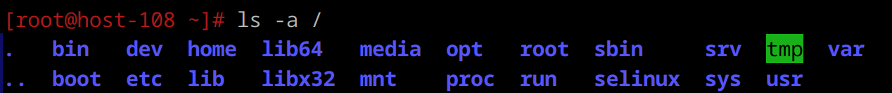
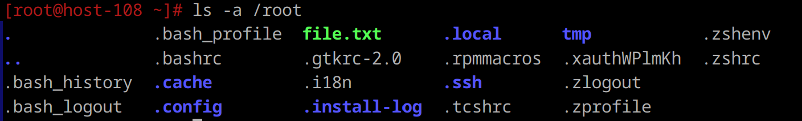

**1) Какая структура каталогов в linux? выведите список файлов в корне системы**

Структура каталогов в Linux организована в виде иерархического дерева с корневым каталогом / , внутри которого находятся подкаталоги с различными функциями.

**2) Где хранятся папки пользователей в системе?**

Папки хранятся в каталоге /home. Этот каталог является основным хранилищем для домашних директорий всех пользователей системы (кроме суперпользователя).

**3) Где домашняя папка суперпользователя?**

**4) Где хранятся основые конфигурационные файлы в системе?**

В Linux хранятся в каталоге /etc. В Linux все настройки хранятся в текстовых файлах, для Windows используется реестр.  
Примеры конфигурационных файлов:
- /etc/fstab: содержит информацию о различных файловых системах и устройствах хранения информации в системе.
- /etc/passwd: описана искомая учетная запись (системное имя, пароль, uid, gid, полное имя, домашний каталог и начальная оболочка через “:”).
- /etc/group: содержит имя группы, gid, список имен пользователей в группе.

**5) Что за папки /bin, /sbin, usr/sbin, /usr/sbin ?**

/bin - содержит необходимые исполняемые файлы пользователя.  
/sbin – содержит исполняемые файлы для работы с системой.  
/usr/bin - содержит дополнительные пользовательские бинарные файлы и утилиты.  
/usr/sbin - содержит дополнительные системные утилиты, предназначенные для администрирования.

/bin и /sbin по сути одно и то же, так как ссылаются друг на друга