**1. Выведите содержимое fstab. Что хранится в fstab?**

fstab  содержит информацию о файловых системах и их точках монтирования. Этот файл используется системой для автоматического монтирования файловых систем при загрузке и для управления файловыми системами в процессе работы. 
Каждая строка содержит название блочного устройства; точку монтирования; 
тип ФС; опции монтирования; бит, указывающий следует ли делать резервное копирование данной ФС; порядок проверки ФС с помощью fsck (0 если проверка не требуется)

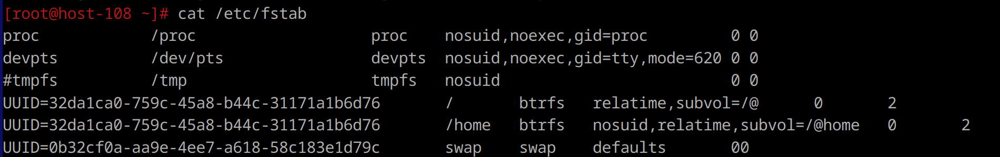

**2. Добавьте в виртуальную машину ещё один диск**

Добавила через vbox

**3. Узнайте как ситема видит ваш диск - выведите информацию о блочных устройствах**

`fdisk -l`

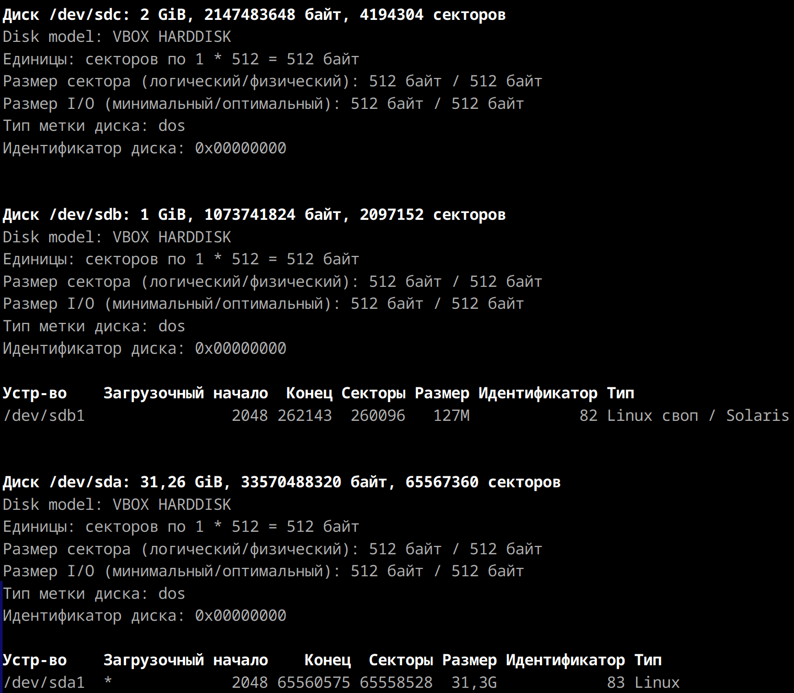

**4. С помощью полученной информации создайте на диске таблицу разделов и фаловую систему ext4**

Было:

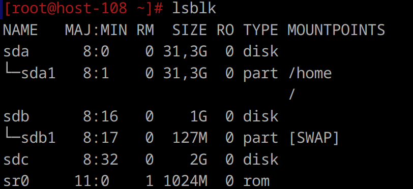

Создание раздела:

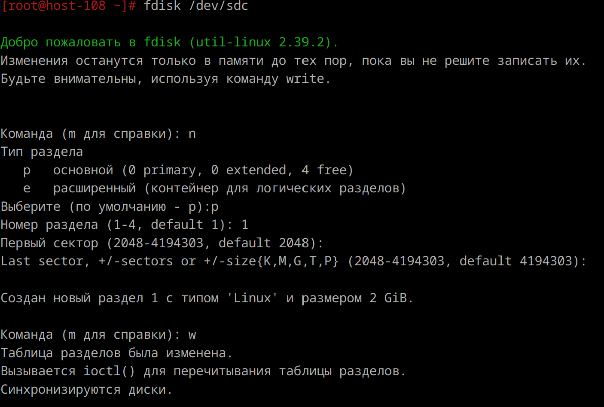

Стало:

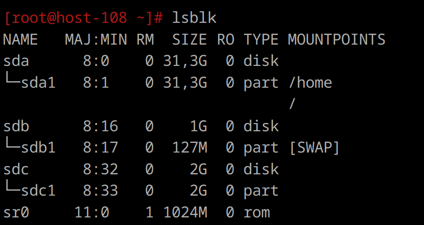

Создание ФС:

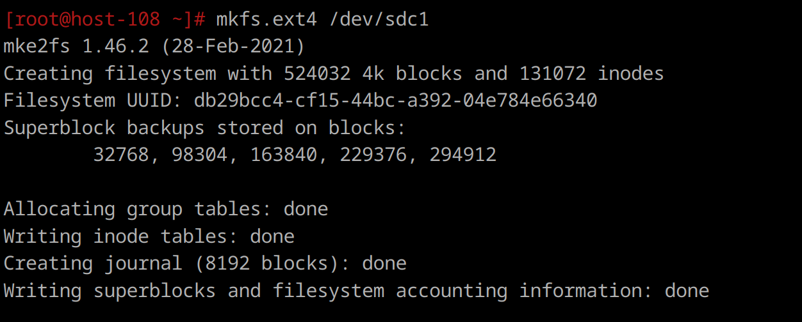

**5. Примонитруте диск в каталог /mnt**

`mount -v /dev/sdb1 /mnt/`

Монтирование и проверка:

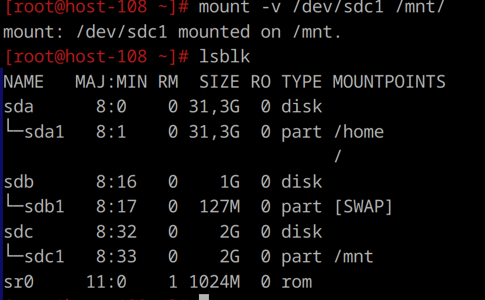

**6. Зайдите в каталог и создайте там файлы**

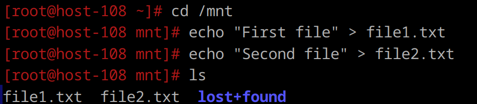

**7. Отмонтируйте диск и проверье остались ли файлы**

`umount /mnt`

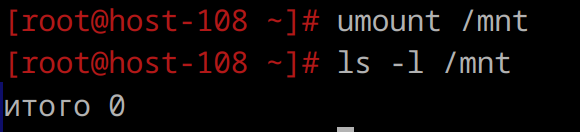

**8. Сделайте так чтобы диск автоматически подключался при загрузке систем ( добавьте информацию о нём с fstab)**
**9. Проверьте корретность записанных в fstab данных перед перезагрузкой**

Для добавления диска в автозагрузку надо добавить его в файл fstab(последня строчка на картике).
- UUID — идентификатор устройства.
- /mnt/mydisk — точка монтирования.
- ext4 — тип файловой системы.
- defaults — стандартные параметры монтирования (чтение/запись, авто, и т.д.).
- 0 — нужен ли дамп устройства (обычно 0).
- 2 — порядок проверки файловой системы (0 = не проверять, 1 = корневая ФС, 2 = другие ФС).

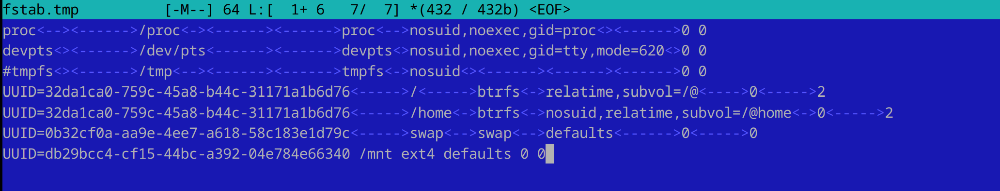

**10. Перезагрущите систему и убедитесь что диск был подключён к системе**

диск подключен:

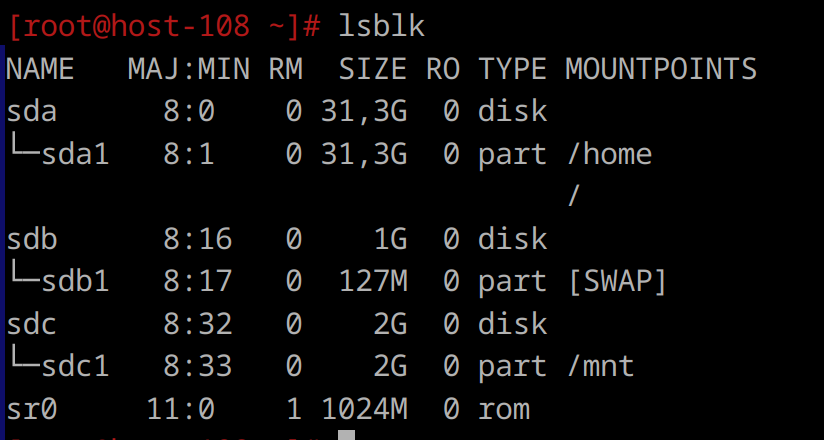
