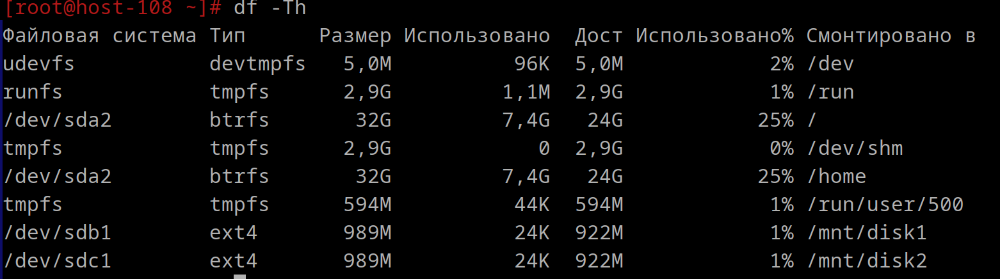
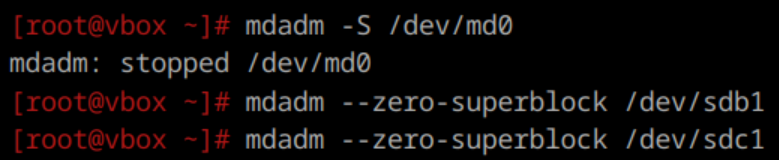
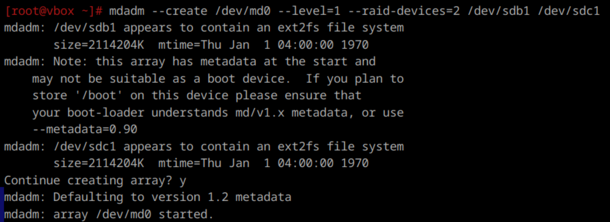

**1. Raid массивы, что такое и какие бывают**  
RAID (Redundant Array of Independent/Inexpensive Disks, избыточный массив независимых/недорогих жёстких дисков) — это технология, которая объединяет несколько дисков в единый массив, управляемый аппаратным RAID-контроллером.
Эти диски взаимосвязаны через высокоскоростные каналы и воспринимаются внешней системой как одно целое.
В зависимости от типа используемого массива, RAID может обеспечивать повышенную надёжность, улучшенную производительность или комбинацию этих двух характеристик.
Наилучшие результаты достигаются при использовании одинаковых накопителей в массиве. 

Основными типы:  
- RAID 0 (striping, чередование) — каждый блок данных записывается на один из дисков в массиве по очереди. Благодаря чередованию данных, RAID 0 обеспечивает высокую скорость чтения и записи, так как операции выполняются параллельно на нескольких дисках, но не предоставляет никакой избыточности или дублирования данных. Это означает, что если один из дисков в массиве выходит из строя, все данные в массиве будут потеряны. Для создания RAID 0 массива требуется минимум два диска. Чем больше дисков в массиве, тем выше производительность, но также выше риск потери данных.
    - *Плюс:* высокая производительность при работе с большим объемом данных.
    - *Минус:* высокий риск потери данных.  

- RAID 1 (mirroring, зеркалирование) — уровень RAID, который фокусируется на повышении надежности и защите данных за счет полного дублирования данных на двух или нескольких дисках(зеркалирование).
    - *Плюсы:* высокая надежность за счет дублирования данных, простота восстановления - в случае сбоя диска, данные могут быть быстро восстановлены на новом диске.
    - *Минусы:* высокие затраты на оборудование, т.к. данные дублируются требуется как минимум в 2 раза больше дискового пространства по сравнению с объемом данных; Ограниченная производительность по сравнению с прошлым типом.

- RAID 5 (striping) - это уровень RAID, который сочетает в себе преимущества как повышенной производительности, так и надежности за счет использования блочного чередования (striping) и распределенной четности. Данные разбиваются на блоки и распределяются по всем дискам в массиве, что позволяет параллельно читать и записывать данные, используется механизм распределенной четности для обеспечения избыточности. Для создания RAID 5 массива требуется минимум три диска. Чем больше дисков в массиве, тем выше производительность и надежность.
    - *Плюсы:* 1) Высокая надежность - если один из дисков в массиве выходит из строя, данные могут быть восстановлены из оставшихся дисков с использованием информации о четности. 2) Повышенная производительность - блочное чередование позволяет параллельно читать и записывать данные, что улучшает производительность. 3) Эффективное использование дискового пространства 
    - *Минусы:* 1) Сложность и большие временные затраты восстановления данных - требуется пересчет информации о четности. 2) Производительность записи может быть ниже по сравнению с RAID 0 или RAID 1 из-за необходимости расчета и записи информации о четности. 3) Нужно минимум три диска, что может быть неудобно для некоторых конфигураций.

- RAID 6 схоже RAID 5, т.к. использует блочное чередование, но с двойным распределением четности, что позволяет восстановить данные в случае сбоя двух дисков. Требуется минимум 4 диска.
    - *Плюсы:* очень высокая надежность, сохраняет в себе все преимущества RAID 5
    - *Минусы:* те же, что при использовании RAID 5

- RAID 1+0 (или 10) — это комбинированный уровень RAID, который сочетает в себе преимущества RAID 1 (зеркалирование) и RAID 0 (чередование). Данные сначала зеркалируются на два или более диска, а затем эти зеркальные копии чередуются по всем дискам в массиве.
    - *Плюсы:* те же, что и у RAID 0 и RAID 1 
    - *Минусы:* высокие затраты на оборудование, минимальное количество дисков - 4.

**2) Добавьте в виртуальную машину 2 диска отформатируйте их в ext4**



**3. Создайте из них raid 0 массив**

```
/dev/md0 — имя создаваемого RAID устройства.
--level=0 — указывает уровень RAID, по заданию 0.
--raid-devices=2 — количество дисков в массиве.
/dev/sdb1 /dev/sdc1 — имена разделов, которые будут использоваться.
```


**4. Проверьте всё ли работает**


**Удалите raid0 и создайте raid1**

Для удаления RAID-массива нужно: отмонтировать массив, остановить его и очистить суперблоки на дисках, чтобы система не пыталась восстановить его при перезагрузке. Также, при необходимости, можно удалить метаданные и подписи с помощью утилиты ```wipefs``` и обновить конфигурацию ```mdadm```.



Создание raid 1 массива


При создании RAID 1 размер не увеличился, так как информация на дисках дублируется и общий объем сохраняемых данных равен наименьшему из объему дисков.
В RAID 0 общий объем равен сумме объемов на дисках.

**7. Есть ли файловые системы которые поддерживают raid массивы без стороненго ПО**
- Файловые системы *Btrfs, ZFS* и *ReFS* поддерживают RAID-массивы на уровне файловой системы, что позволяет создавать и управлять RAID-массивами без необходимости использования стороннего программного обеспечения, упрощая управление, повышая надежность и позволяя более эффективно использовать ресурсы системы.

- *Btrfs* — это современная файловая система для Linux, которая поддерживает различные уровни RAID (RAID 0, RAID 1, RAID 5, RAID 6 и RAID 10) на уровне файловой системы. Btrfs позволяет создавать RAID-массивы и управлять ими без необходимости использования стороннего программного обеспечения, такого как ```mdadm```.
 ```
   mkfs.btrfs -d raid1 /dev/sda /dev/sdb
 ```
- *ZFS* — это высокопроизводительная файловая система, разработанная Sun Microsystems, которая поддерживает различные уровни RAID (RAID 0, RAID 1, RAID 10, RAID-Z1, RAID-Z2 и RAID-Z3) на уровне файловой системы. ZFS интегрирует функции RAID непосредственно в свою архитектуру.
```
   zpool create mypool mirror /dev/sda /dev/sdb
 ```
  - *ReFS (Resilient File System)* - это файловая система, разработанная Microsoft для Windows Server и Windows. ReFS поддерживает функции RAID на уровне файловой системы, такие как зеркалирование и чередование.
```
   New-Volume -FileSystem ReFS -FriendlyName "MirrorVolume" -StoragePoolFriendlyName "StoragePool" -ResiliencySettingName Mirror -Size 10GB
 ```
  
**8. Можно ли создать raid массив во время установки системы?**

Можно, в том числе и при установке дистрибутивов ALT Linux (как серверных, так и настольных). Для его создания потребуются минимум два одинаковых жёстких диска.

