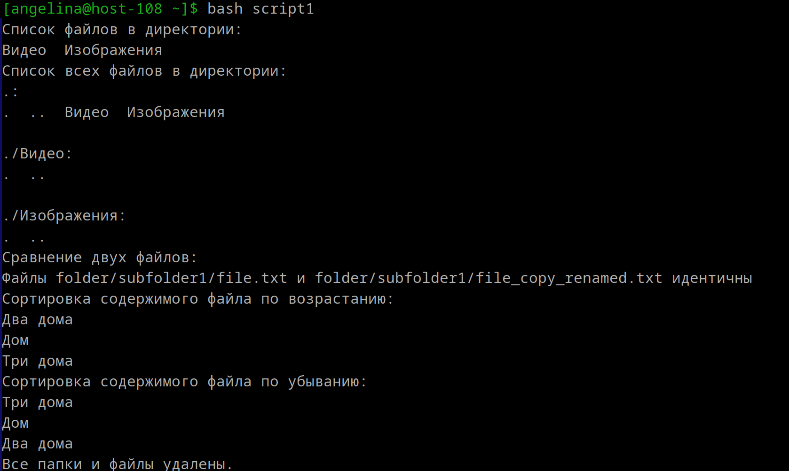

1. **Шебанг**
    Специальная последовательность символов #!, размещаемая в начале скриптовых файлов в Unix-подобных операционных системах и указывающая системе путь к интерпретатору скрипта. Для bash: `#!/bin/bash `

---

2. **Расширение исполняемых файлов**
    Расширение файла В Unix-подобных системах не важно при выполнении. Главное — наличие прав на выполнение и правильная интерпретация шебанга (#!).

   Если файл не является бинарным, он считается текстовым (скриптом или сценарием). В первых двух байтах сценария может присутствовать последовательность символов #!. Если эта последовательность обнаружена, ядро интерпретирует всю первую строку сценария, начиная с третьего байта, как команду обработки. Исполнение сценария, содержащего эту последовательность, приведет к запуску команды, указанной после #!, с именем самого файла сценария в качестве последнего параметра.
   Например, для файлов, написанных на языке shell script, первая строка может выглядеть так:
---

3. **Скрипт**  
    `set -e`: заставляет скрипт завершаться, если любая команда возвращает ненулевой статус (т.е. происходит ошибка).  
    `set -u`: вызывает ошибку, если в скрипте используется необъявленная переменная.  
    `set -o pipefail`: изменяет поведение конвейеров (pipes, `|`) так, что возвращаемый статус будет ненулевым, если любая команда в конвейере завершается с ошибкой. По умолчанию статус конвейера равен статусу последней команды. 
```
#!/bin/bash

set -euo pipefail

cd /home/angelina/Документы

# 2) Вывести список файлов в директории
echo "Список файлов в директории:"
ls

# 3) Вывести список всех файлов в директории
echo "Список всех файлов в директории:"
ls -aR

# 1) Переместиться между директориями
mkdir /home/angelina/Документы/test_for_files_script
cd /home/angelina/Документы/test_for_files_script

# 4) Создать папку с подпапками
mkdir -p folder/subfolder1/subfolder2

# 5) Внутри папки создать файлик и записать в него что-нибудь
echo "Дом" > folder/file.txt
echo "Два дома" >> folder/file.txt
echo "Три дома" >> folder/file.txt


# 6) Переместить файл из одной директории в другую
mv folder/file.txt folder/subfolder1/

# 7) Скопировать файл из одной директории в другую
cp folder/subfolder1/file.txt folder/subfolder1/file_copy.txt

# 8) Переименовать файл
mv folder/subfolder1/file_copy.txt folder/subfolder1/file_copy_renamed.txt

# 9) Сравнить содержимое файла
echo "Сравнение двух файлов:"
diff -s folder/subfolder1/file.txt folder/subfolder1/file_copy_renamed.txt

# 10) Отсортировать содержимое файла по возрастанию и убыванию
echo "Сортировка содержимого файла по возрастанию:"
sort folder/subfolder1/file.txt

echo "Сортировка содержимого файла по убыванию:"
sort -r folder/subfolder1/file.txt

# 11) Удалить все папки и файлы
cd /home/angelina/Документы
rm -rf test_for_files_script

echo "Все папки и файлы удалены."


Чтобы использовать, надо создать файл с расширением .sh, вставить туда скрипт, сохранить, сделать файл исполняемым и запустить скрипт:

Создание: `script1.sh`

Сделать испольняемым: `chmod +x script1.sh`
```


