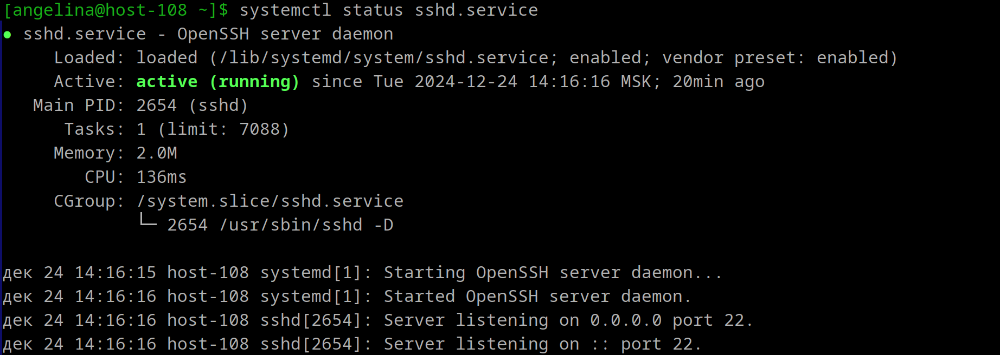

1. **Юниты**  
   Linux, особенно в дистрибутивах, использующих систему инициализации systemd, "юниты" (units) — основные строительные блоки, которые управляют различными аспектами системы: сервисами, устройствами, монтированием файловых систем, таймерами и т.д. Юниты определяют, как и когда должны быть запущены или остановлены различные компоненты системы.
---

2. **Вывод инфы о юните**  
    `systemctl` - главный инструмент для управления службами в Linux. Чтобы проверить статус любого systemd юнита, используется команда:
    ```
    systemctl status имя_юнита
    ```
    Примеры выводов:  


3. **Остановка сервиса**  
`systemctl stop имя_сервиса.service`

4. **Перезапуск сервиса**  
`systemctl restart имя_сервиса.service`

5. **Удаление из автозагрузки**  
`systemctl disable имя_сервиса.service`

6. **Возврат обратно**  
`systemctl enable имя_сервиса.service`

---

7. **Таймеры**  
    *Таймеры* — файлы юнитов systemd, имя которых имеет суффикс .timer.

   *Таймеры в systemd* — это файлы юнитов с суффиксом .timer, которые позволяют контролировать выполнение файлов .service или определенных событий. Они могут служить заменой для cron, предоставляя встроенную поддержку календарных и регулярных событий, а также возможность запуска в асинхронном режиме. Таймеры позволяют запускать службы или выполнять скрипты по расписанию или в ответ на определенные события, такие как загрузка системы. Они могут быть настроены на выполнение через заданные интервалы времени или в определенные моменты.
   - Команды для работы с таймерами:  
    ```
    Чтобы увидеть, какие таймеры работают на данный момент:
    systemctl list-timers

    Для проверки состояния конкретного таймера:
    systemctl status имя_таймера.timer
    ```
С каждым таймером связано минимум шесть строк, содержащих сведения о нём:

1) Имя файла таймера, краткое описание того, какую роль он будет выполнять (не всегда).

2) Информация о состоянии таймера, полный путь к его файлу, состояние vendor preset (disabled или enabled).

3) Информация об активности таймера, там же есть сведения о том, когда таймер был активирован.

4) Дата и время следующего запуска таймера и примерное время, оставшееся до его запуска.

5) Имя сервиса или события, которое вызывает таймер.

6) У некоторых таймеров есть указатели на документацию.
