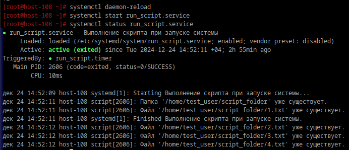

1. **Скрипт**
    ```
    #!/bin/bash

    set -euo pipefail
    # Название папки
    DIR_NAME="my_folder"

    # Проверка существования папки
    if [ -d "$DIR_NAME" ]; then
        echo "Папка '$DIR_NAME' уже существует."
    else
        mkdir "$DIR_NAME"
        echo "Папка '$DIR_NAME' создана."
    fi

    # Создание и заполнение файлов

    # Файл с текущей датой
    DATE_FILE="$DIR_NAME/1.txt"
    if [ -f "$DATE_FILE" ]; then
        echo "Файл '$DATE_FILE' уже существует."
    else
        echo "Текущая дата: $(date)" > "$DATE_FILE"
        echo "Файл '$DATE_FILE' создан и заполнен."
    fi

    # Файл с версией ядра
    KERNEL_FILE="$DIR_NAME/2.txt"
    if [ -f "$KERNEL_FILE" ]; then
        echo "Файл '$KERNEL_FILE' уже существует."
    else
        echo "Версия ядра: $(uname -r)" > "$KERNEL_FILE"
        echo "Файл '$KERNEL_FILE' создан и заполнен."
    fi

    # Файл с именем компьютера
    HOSTNAME_FILE="$DIR_NAME/3.txt"
    if [ -f "$HOSTNAME_FILE" ]; then
        echo "Файл '$HOSTNAME_FILE' уже существует."
    else
        echo "Имя компьютера: $(hostname)" > "$HOSTNAME_FILE"
        echo "Файл '$HOSTNAME_FILE' создан и заполнен."
    fi

    # Файл со списком файлов в домашнем каталоге
    HOME_FILES_FILE="$DIR_NAME/4.txt"
    if [ -f "$HOME_FILES_FILE" ]; then
        echo "Файл '$HOME_FILES_FILE' уже существует."
    else
        echo "Список файлов в домашнем каталоге:" > "$HOME_FILES_FILE"
        ls ~ >> "$HOME_FILES_FILE"
        echo "Файл '$HOME_FILES_FILE' создан и заполнен."
    fi

Чтобы использовать, надо создать файл, вставить туда скрипт, сохранить, сделать файл исполняемым и запустить скрипт.

Проверка


2. **Создайте юнит который будет вызывать этот скрипт при запуске. Проверьте**

юнит:
```
[Unit]
Description=Runs my script at startup

[Service]
Type=oneshot
ExecStart=/home/angelina/Документы/script
RemainAfterExit=true

[Install]
WantedBy=multi-user.target
```
Раздел [Unit] хранит общие сведения о юните. В данном случае он содержит только описание (Description).

Раздел [Service] объединяет сведения, необходимые для выполнения юнитом его задач. Type - тип сервиса, oneshot - сервис выполняет задачу один раз и останавливается. ExecStart - путь до скрипта, выполняемого сразу после запуска сервиса. RemainAfterExit=true предписывает systemd считать процесс активным после его завершения.

Секция [Install] содержит информацию об условиях, при которых должен быть запущен сервис. WantedBy=multi-user.target устанавливает запуск при обычной загрузке компьютера.

добавление в автозагрузку:

`` systemctl enable run_script.service ``

проверка работы юнита


**3) Создайте таймер который будет вызывать выполнение одноимённого systemd юнита каждые 5 минут.**

создание файла таймера


OnBootSec=5min — первый запуск через 5 минут после загрузки системы.

OnUnitActiveSec=5min — последующие запуски каждые 5 минут после предыдущего выполнения.

Unit=create_and_fill.service — таймер будет запускать юнит run_script.service.

Добавление в автозагрузку, запуск и проверка работы


**4) От какого пользователя вызыаются юниты поумолчанию?**

От имени пользователя, который вошел в систему. Экземпляр systemd --user, управляющий пользовательскими службами, запускается самостоятельно при первом входе в систему и продолжает работать до конца сессии данного пользователя.

**5)Создайте пользователя от имени которого будет выполняться ваш скрипт.**\
`useradd test_user`

**6)Дополните юнит информацией о пользователе от которого должен выполняться скрипт.**

Вносим следующие изменения:
```
HOME_DIR="$(eval echo "~$(whoami)")"   
DIR_NAME="$HOME_DIR/script_folder"  
```
В разделе [Service] добавляем строчку User=test_user

Перезагружаем systemd, перезагружаем систему и проверяем сервис:


