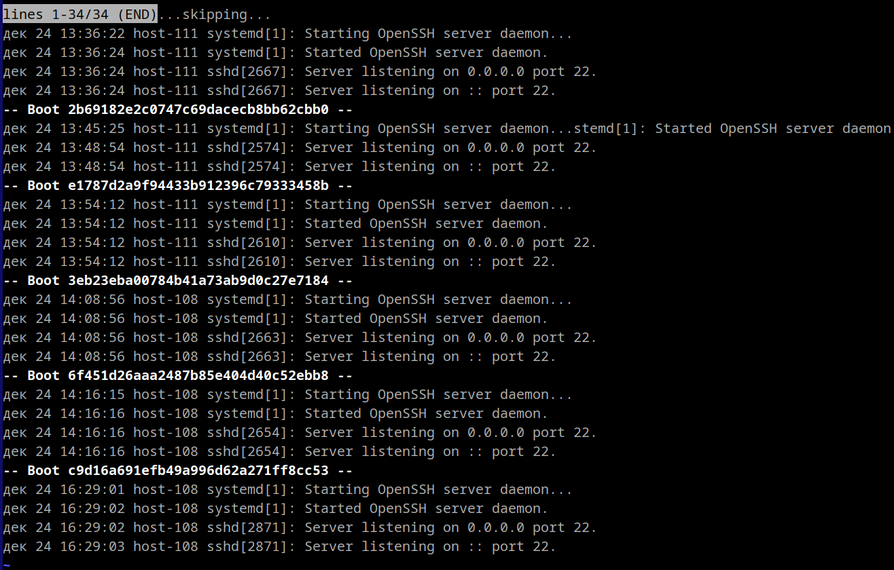
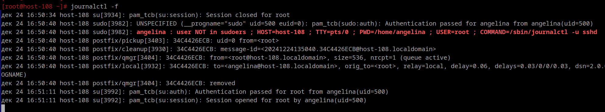
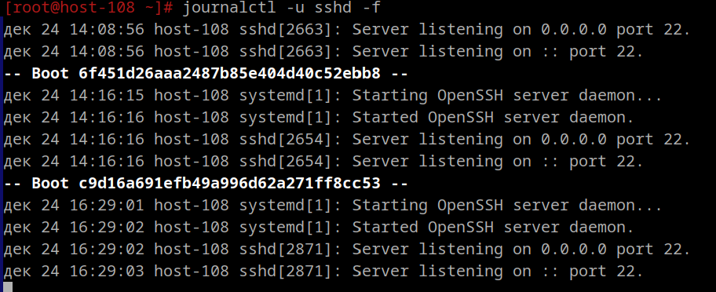
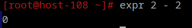

**1. Посмотретите журналы ssh**

Уточнение конкретной службы: Когда используется -u <имя_службы>, выводятся только логи, которые относятся к указанной службе. 

**2. Выведите журналы в реальном времени**

Ключ -f в команде journalctl нужен для отображения логов в режиме реального времени.

Использование команды journalctl без -f, позволит вывести все доступные журналы службы или системы, начиная с момента включения ведения логов.

**3. Выведите лог в реальном времени для службы sshd**

**4. Можно ли без комады journalctl прочитать логи systemd?**

Да, но это требует прямого обращения к бинарным файлам журналов systemd.

Они хранятся в бинарном формате в каталоге:
/var/log/journal/

**5. Сколько будет 2-2?**

