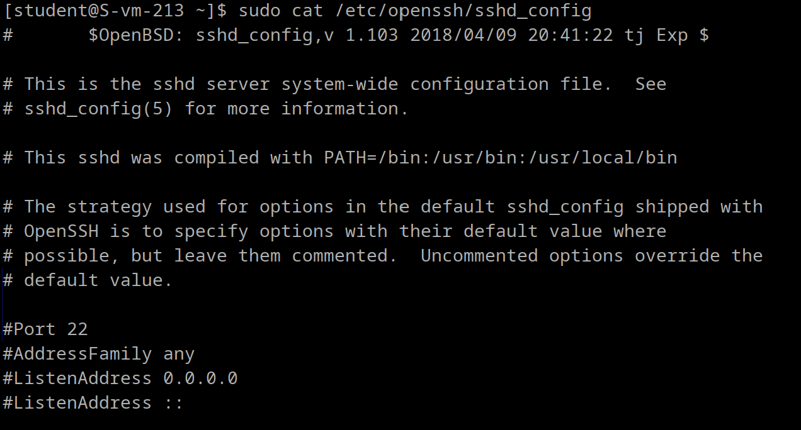
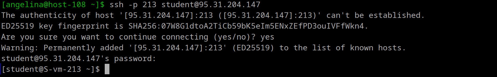
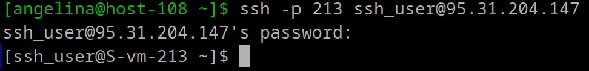
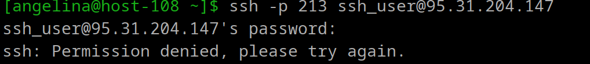
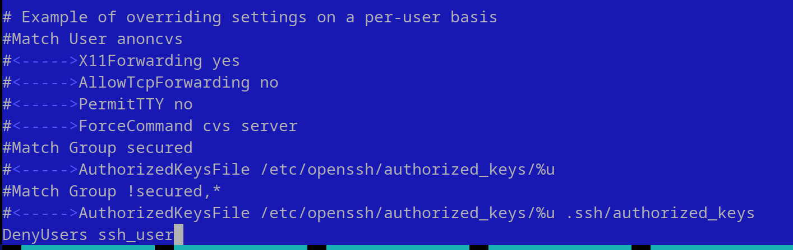

**1. Какой по умолчанию используется порт для поключения?**

Используется порт 22, который задан в стандартных настройках как SSH-сервера (sshd), так и клиента (ssh).

**2. Можно ли его изменить? если да, то как?**

Да. В файле конфигурации SSH необходимо изменить строку, в которой указан порт.
**3. Какая служба отвечает за обработку запросов на подключения по ssh?**

sshd (SSH Daemon). Она работает в фоновом режиме, обрабатывая входящие запросы на подключение по протоколу SSH. При установке нового соединения sshd создает новый экземпляр себя (с помощью вызова fork), который занимается аутентификацией, обменом ключами и выполнением команд.

**4. Какой файл конфигурации отвечает за его настройку?**

ssh

**5. Попробуйте подключиться по ssh к предоставленному вам серверу**

подключилась:
`` ssh -p 209 student@95.31.204.147``

**6. Отредактируйте файл настроек на сервере так, чтобы была возможность подключиться к серверу используя пользователя root**

В файле sshd_config нужно найти строку, начинающуюся с `PermitRootLogin` и измените её значение на `PermitRootLogin yes`. После сохранения изменений перезапустить SSH.

**7. Измените колличество ошибок ввода пароля перед сборосом соединения, покажите эти измененения**

Для этого нужно добавить строку `MaxAuthTries` и указать количество попыток через пробел в том же файле sshd_config. Затем снова перезагрузите службу SSH.

**8. Создайте пользователя ssh-user и попробуйте им подключиться к серверу**

**9. Ограничте ему возможность подключения к серверу**

**10. Как вы это сделали?**

Я добавила в файл sshd_config строку DenyUsers с указанием имени пользователя, которому запрещен доступ.

**11. Что хранится в файле known_hosts?**

Файл known_hosts содержит информацию о серверах, к которым клиент SSH ранее подключался, и используется для проверки подлинности сервера при последующих подключениях, чтобы предотвратить атаки типа "man-in-the-middle".

Каждая строка в файле представляет собой запись для одного удалённого хоста и включает:

1. Адрес сервера или его имя, например, IP-адрес (192.168.1.1) или доменное имя (example.com). Адрес может быть в хешированном виде для дополнительной конфиденциальности.

2. Тип ключа, например, ssh-rsa, ecdsa-sha2-nistp256, ssh-ed25519.

3. Открытый ключ сервера (public key), который используется для проверки подлинности сервера.
