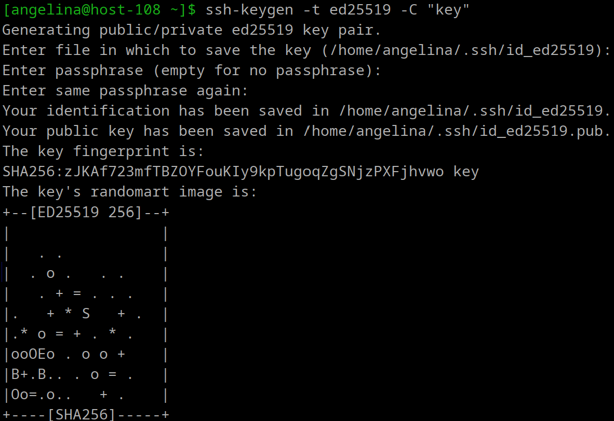
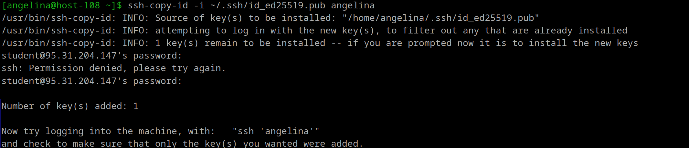
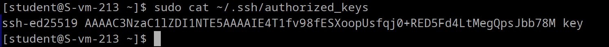
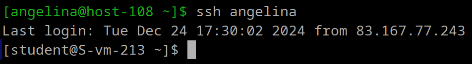

**1. Что такое ssh ключи и зачем они нужны?**

SSH-ключи представляют собой пару криптографических ключей, используемых для аутентификации в протоколе SSH (Secure Shell). Они обеспечивают безопасный способ входа на сервер без необходимости ввода пароля.

Как устроены SSH-ключи?
Пара ключей включает:

1) Приватный ключ (Private Key):
    - Хранится на клиентской машине.
    - Является секретным и никогда не передаётся никому.
    - Используется для подписания данных.

2) Публичный ключ (Public Key):
    - Передаётся на сервер.
    - Добавляется в файл `~/.ssh/authorized_keys` на сервере.
    - Используется для проверки подписи, созданной приватным ключом.

Приватный и публичный ключи математически связаны, но зная только публичный ключ, невозможно восстановить приватный.

**2. Как их создать?**

Создание пары ключей осуществляется с помощью команды:
`ssh-keygen`
Команда предложит указать имя файла для сохранения ключей (по умолчанию `~/.ssh/id_rsa`).

Есть возможность установить пароль для защиты приватного ключа или оставить его пустым.
**3. Создайте пару публичный/приватный ключ ed_25519, где они хранятся?**

Параметр `-t` определяет тип ключа (`[-t dsa | ecdsa | ecdsa-sk | ed25519 | ed25519-sk | rsa]`).
По умолчанию ключи сохраняются в каталоге ~/.ssh/:
```
Приватный ключ: ~/.ssh/id_ed25519
Публичный ключ: ~/.ssh/id_ed25519.pub
```
Если необходимо указать другое имя файла или местоположение, нужно ввести соответствующий путь.


**4. Скопируйте публичный ключ на ваш сервер, в каком файле он будет храниться?**



Хранится в файле authorized_keys



`
Now try logging into the machine, with:   "ssh 'angelina'"
and check to make sure that only the key(s) you wanted were added.
`

это сообщение говорит, что ssh-copy-id успешно добавил публичный ключ в файл ~/.ssh/authorized_keys на сервере пользователя. Теперь можно попробовать подключиться к серверу без ввода пароля с помощью команды:
`ssh angelina`

**5. Попробуйте подключиться к серверу, у вас запросили пароль?**

Нет



**6. Запретите подключение с паролем для всех пользователей, оставьте только с помощью ключа.**

Для этого в файле /etc/openssh/sshd_config надо добавить или изменить следующие строчки:

`PasswordAuthentication no`

Убедиться, что PubkeyAuthentication установлен в yes, а UsePAM — в no, затем перезапустите SSH.

Таким образом, любые методы аунтефикации, основанные на пароле, будут отклонены. Сервер будет принимать только SSH-ключи для аутентификации.
