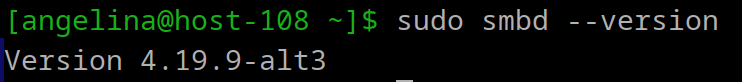
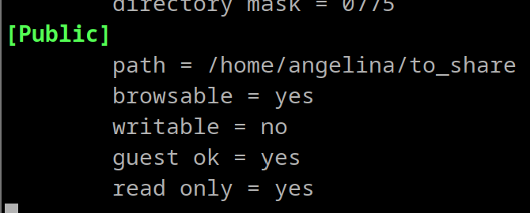
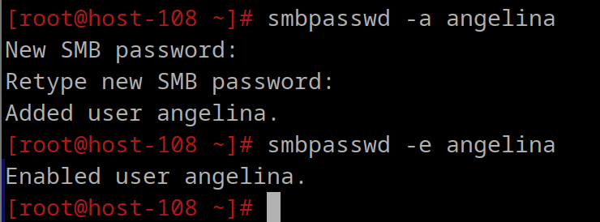
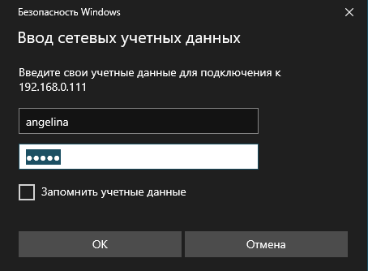
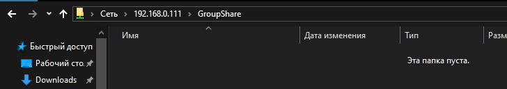
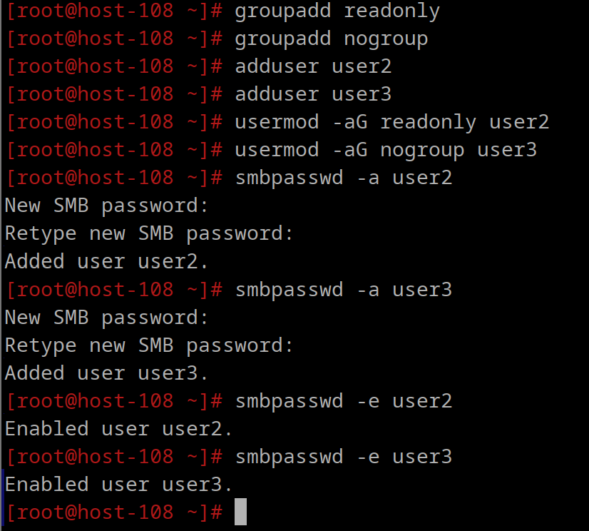
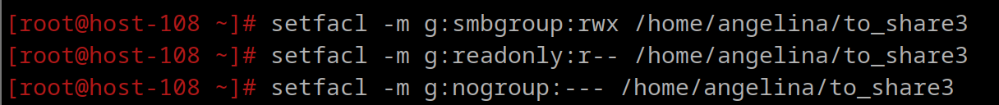
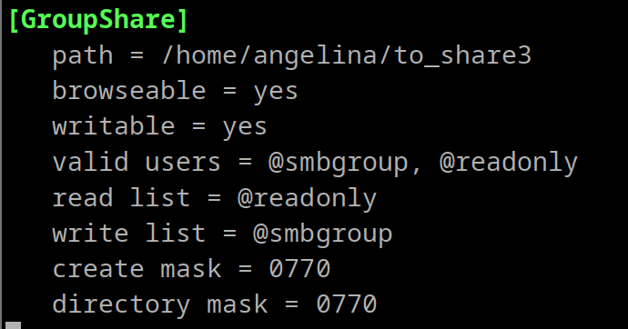
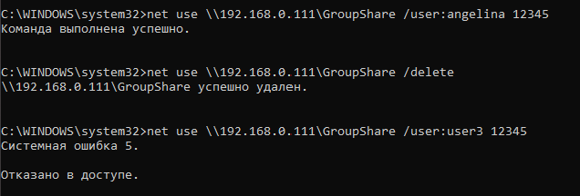

# Шарим


**1. Установите пакет samba**

`apt-get install samba`

`apt-get install samba-client`
установлена:



**2. Что такое общая папка, зачем оно может быть нужно?**

    Общая папка (сетевая папка) — это каталог на компьютере или сервере, доступный для других пользователей в локальной сети. Он позволяет пользователям совместно использовать файлы и ресурсы, такие как документы, изображения, видео и другие данные, через локальную сеть (LAN) или интернет. Общие папки широко используются в корпоративных и домашних сетях для обмена информацией и совместной работы без использования флешек и мессенджеров.

    Как работает общая папка?
    Она настраивается с помощью файлового сервиса:

    - Samba (для совместимости между Windows и Linux).

    - Windows File Sharing (для Windows).

    - NFS (Network File System) для Linux-систем.

    - FTP или WebDAV для удаленного доступа через интернет.

    Доступ после настройки к этой папке пользователи могут получить по её имени или IP-адресу компьютера, где она находится.

**3. Создайте общую папку без пароля с правами только на чтение файлов**

    создала папку:
    `mkdir -p /home/angelina/shared`

    сделала ее только для чтения: `sudo chmod -R 755 /srv/shared`

    добавила изменения в файл /etc/samba/smb.conf:



    Здесь:
    - path: Указывает путь к папке.
    - browsable: Делает папку видимой в сетевом окружении.
    - writable: Запрещает запись (только чтение).
    - guest ok: Разрешает доступ без пароля (гостевой - - доступ).
    - read only: Указывает, что доступ будет только на чтение.

    все работает:
    


**4. Создайте общую папку с паролем с правами на чтение и запись**

создала папку, установила права:


770: Владелец и группа могут читать, записывать и выполнять. Остальные не имеют доступа.

Создала и активировала пользователя, от которого будем получать доступ к папке:



Ввод пароля



все работает

**5. Создайте общую папку с доступом для какой-то группы с полными правами**

    Создала группу и добавила пользователей

    groupadd smbgroup
    usermod -aG smbgroup angelina
    usermod -aG smbgroup test_user ##(был из прошлого задания)
```
создала папку и поставила нужные права доступа

mkdir -p /home/angelina/shared_group
chown -R angelina:smbgroup /home/angelina/shared_group
chmod -R 770 /home/angelina/shared_group
```
```
Добавила и активировала пользователей в samba (angelina уже был активен)
smbpasswd -a test_user
smbpasswd -e test_user
```
в файл /etc/samba/smb.conf добавила
```
[GroupShare]
   path = /home/angelina/shared_group
   browseable = yes
   writable = yes
   valid users = @smbgroup
   create mask = 0770
   directory mask = 0770

   
valid users = @smbgroup: Доступ имеют только члены группы smbgroup.

create mask и directory mask: Новые файлы и папки будут создаваться с правами, которые дают доступ к полному управлению владельцу и группе.
```

все работает: 



**6. Создайте общую папку в которой у одной группы будет полный доступ, а у другой только доступ на чтение.
Третья группа не должна иметь к ней доступа**

создала пользователей, распределила по группам, добавила в samba и активировала



настройка прав доступа для групп с помощью ACL(Access Control Lists)



обновление секции для папки в /etc/samba/smb.conf


```
valid users = @fullaccess, @readonly: Доступ только для групп fullaccess и readonly.

read list = @readonly: Группа readonly имеет доступ только на чтение.

write list = @fullaccess: Группа fullaccess имеет полный доступ.
```
презапустила samba, все работает


