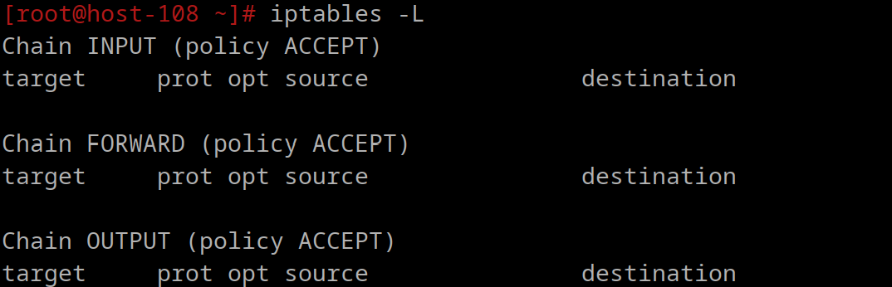
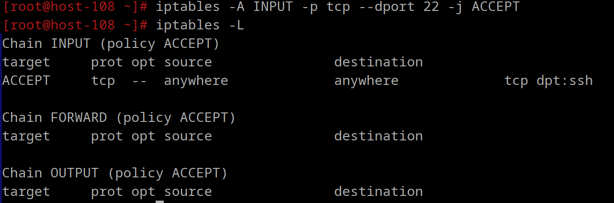

# Открываем iptables

1. Установите iptables

    `apt-get install iptables`

2. Проверьте осталась ли возможность подключения по ssh к вашему серверу

    нет

    

3. Почему может пропасть такая возможность?

    - Блокировки порта 22: Если iptables настроен для блокировки или дропа всех входящих соединений.
    - Ошибки в правилах: Неверно указанный интерфейс, порт или IP-адрес.
    - Сбрасывающего правила: Установлено правило DROP без исключения для SSH.
    - Отсутствия правила: Все входящие соединения блокируются по умолчанию, а исключение для SSH не добавлено.

4. Откройте нужный порт на сервере чтобы восстановить подключение

    iptables -A INPUT -p tcp --dport 22 -j ACCEPT

    Здесь:
    
-A INPUT

     - Добавляет (-A, от "Append") правило, применяемое ко всем пакетам, приходящим на сервер, в цепочку INPUT, отвечающую за входящий трафик.
-p tcp

     - Указывает протокол, для которого применяется правило. В данном случае — TCP.
--dport 22

     - Указывает номер порта назначения (в данном случае 22), соответствующего пакету.
     - Порт 22 используется для протокола SSH.
-j ACCEPT

     - Указывает действие, выполняемое, если пакет удовлетворяет критериям правила.
     - ACCEPT означает, что пакет должен быть принят (разрешён).

5. Это будет udp или tcp прот?

    TCP-протокол, т.к. он дает надёжное соединение с контрольной проверкой доставки пакетов.
    По умолчанию ssh слушает tcp порт

# Сохраняем

6. Сохраняются ли записанные вами правила после перезагрузки?

    По умолчанию правила iptables не сохраняются после перезагрузки. После повторного запуска сервера нужно будет вводить настройки заново.
7. Как их сохранить?

Установить пакет iptables-save и сохранять/подгружать правила с iptables-save [-m modprobe] [-c] [-t таблица] [-f имя файла] и iptables-restore [-chntvV] [-w секунды] [-W миллисекунды] [-T таблица] [имя файла].
