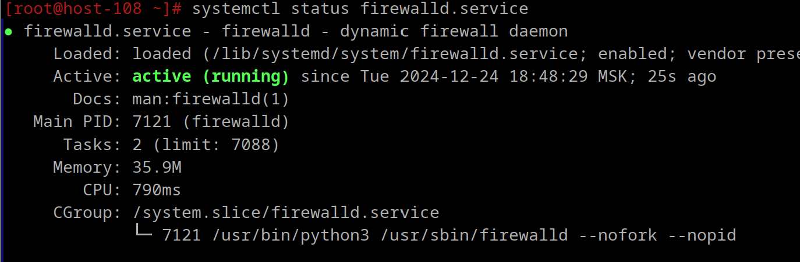
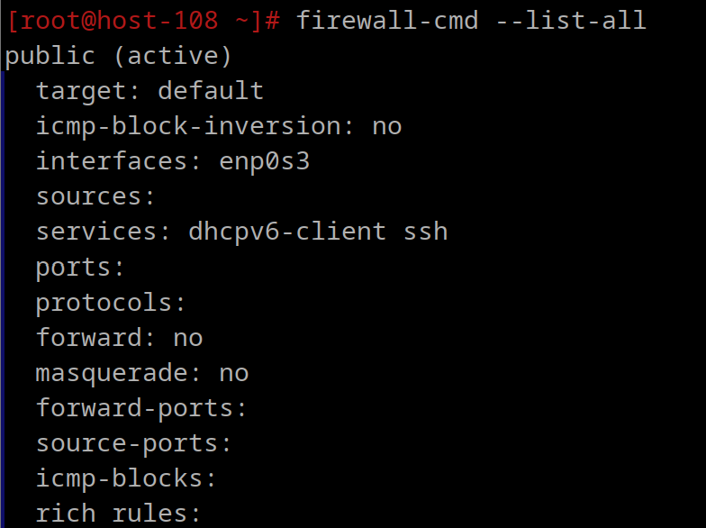
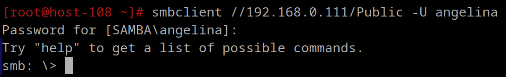
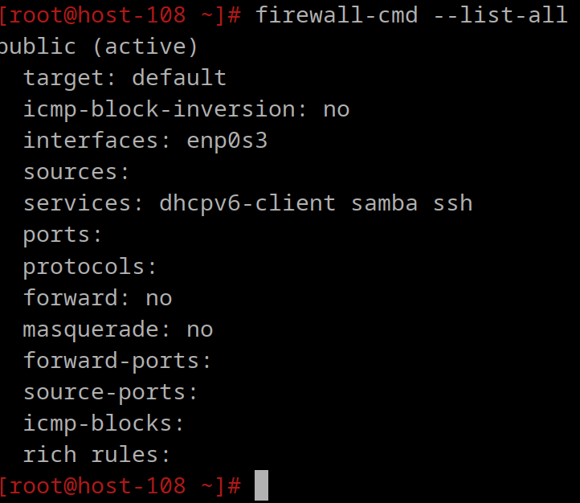

**1. Удалите iptables и установите firewalld**

```
apt-get remove iptables
apt-get install firewalld
systemctl start firewalld
systemctl enable firewalld
```


**2. Попробуйте так-же проверить возможность подключения по ssh**

ssh открыт



**3. Если её нет то откройте порт**

```
sudo firewall-cmd --add-service=ssh --permanent
sudo firewall-cmd --reload

Параметры:
--add-service=ssh: Разрешает доступ по сервису ssh (порт 22/TCP).
--permanent: Делает изменение постоянным.
--reload: Применяет изменения.
```

**4. Выведите список открытых портов с помощью firewall-cmd**

`firewall-cmd --list-all`

**5. Можно ли там добавить порты по названию сервиса?**

Можно, пример:
```
firewall-cmd --add-service=samba --permanent
firewall-cmd --reload
```

**6. (7.) На вашей Локальной виртуальной машине попробуйте подключиться к серверу samba из предыдущих заданий.Если не получилось то откройте нужные порты**

Получилось



**9. Сделайте так чтобы изменения были постоянными**

Так как команды с флагом --permanent сохраняют изменения в конфигурации firewalld, они остаются активными после перезагрузки.

Чекаем


