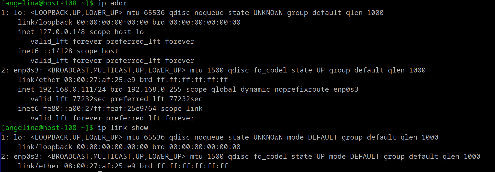
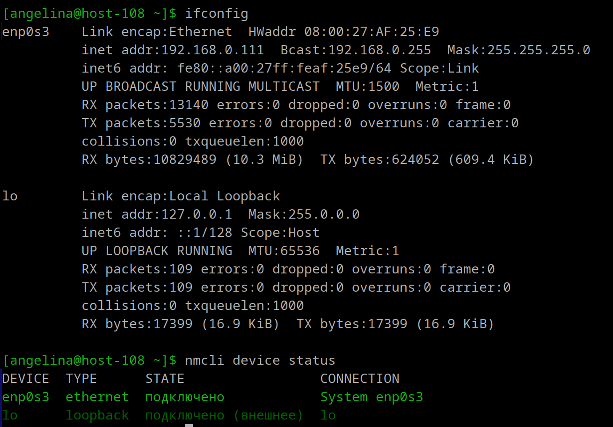
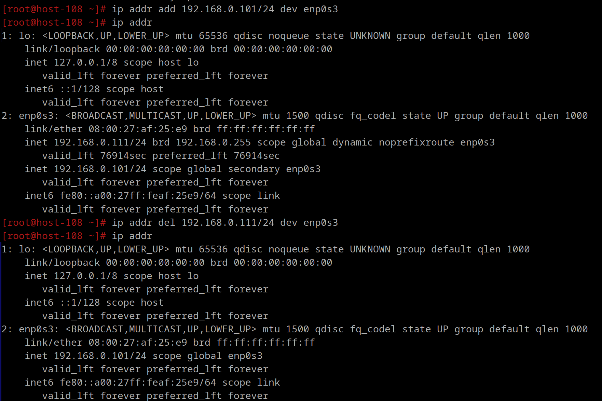
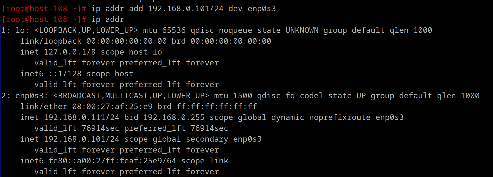
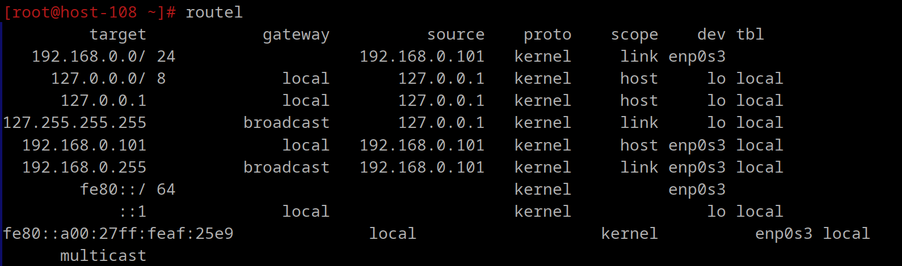
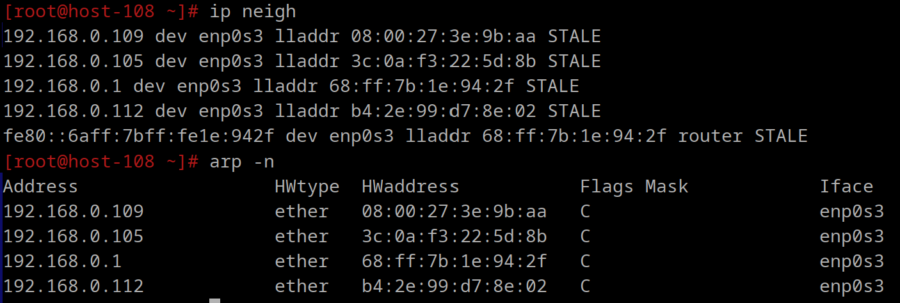
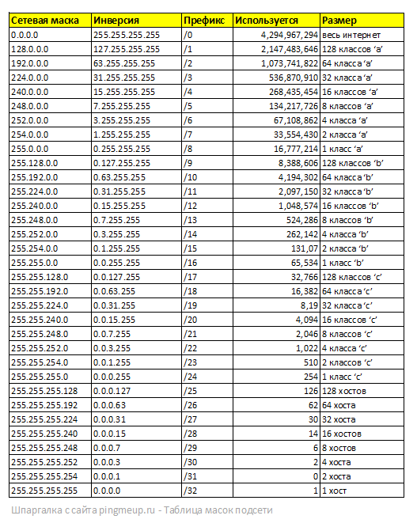

# сети

**1. Выведите список интерфейсов, какими способами можно это сделать?**

ip addr и ip link show:



ifconfig и nmcli device status:



**2. Попробуйте изменить ip адрес**

установка нового, удаление текущего и проверка:



**3. Попробуте добавить несколько ip адресов на сетевую карту**



**4. Выведите список маршрутов**



**5. Выведите arp таблицу**

`arp -n` или `ip neigh`:



**6. Что такое ip адрес?**

IP-адрес (Internet Protocol Address) — это уникальный идентификатор, присваиваемый каждому устройству в сети, работающей по протоколу IP (Internet Protocol). IP-адреса используются для маршрутизации и доставки пакетов данных между устройствами в сети. Существует два основных типа IP-адресов: IPv4 и IPv6.
- IPv4 (Internet Protocol Version 4) — четвертая версия протокола IP, которая использует 32-битные адреса. IPv4-адреса обычно записываются в десятичной форме с точками, разделяющими четыре октета, каждый из которых представляет собой число от 0 до 255. (например, 192.108.6.1),предоставляет около 4,3 миллиарда уникальных адресов.
- IPv6 (Internet Protocol Version 6) — шестая версия протокола IP, которая использует 128-битные адреса. IPv6 был разработан для решения проблемы исчерпания адресного пространства IPv4. Они состоят из восьми групп по четыре шестнадцатеричных цифры, разделенных двоеточиями. Около 340 секстиллионов (3.4 × 10^38) уникальных адресов.

Пример: 2001:0db8:85a3:0000:0000:8a2e:0370:7334

**7. Для чего нужны маршруты?**

Они нужны для определения пути, по которому пакеты данных передаются от источника к назначению в сети, и играют ключевую роль в направлении трафика через локальные и внешние сети, обеспечивая эффективную и надежную доставку данных.

Типы сетевых маршрутов:
- *Статические маршруты.* Задаются вручную администратором сети и не изменяются автоматически. Используются в небольших или стабильных сетях, где топология сети редко изменяется. 
- *Динамические маршруты.* Автоматически изменяются в зависимости от состояния сети. Используются в больших и сложных сетях, где топология сети может часто изменяться.
  
**8. Что за протокол arp?**

ARP (Address Resolution Protocol) —  это сетевой протокол, используемый для отображения IP-адресов в MAC-адреса в локальной сети. ARP позволяет устройствам в сети определить физический адрес (MAC-адрес) устройства, зная его логический адрес (IP-адрес). Нужно для передачи данных в сетях, использующих протокол IP.

**9. Что такое dhcp?**

DHCP (Dynamic Host Configuration Protocol) — протокол, который автоматически назначает IP-адреса, маски подсети, шлюз и DNS-сервера устройствам в сети.
Протокол управляет пулом доступных IP-адресов и следит за тем, чтобы один и тот же адрес не был назначен нескольким устройствам одновременно. Это предотвращает конфликты адресов в сети.

**10. Что такое dns?**

DNS (Domain Name System) — это сетевой протокол, используемый для автоматического назначения IP-адресов и других сетевых параметров устройствам в сети, что упрощает управление сетью, обеспечивая централизованное управление сетевыми конфигурациями.
У DNS есть возможность кэшировать информацию об IP-адресах, которые запрашивались ранее, ускоряя таким образом доступ к наиболее посещаемым сайтам, при этом кэшированный адрес можно быстро вернуть без повторного обращения к другим серверам. 

**11. Как называется один из протоколов синхронизации времени?**

NTP (Network Time Protocol)

**12. Что такое широковещательный запрос, зачем он нужен?**

Широковещательный запрос — это сетевой запрос, который вместо того, чтобы направлять запрос конкретному устройству, отправляет широковещательный запрос, ограниченный локальной сетью и не передающийся за пределы маршрутизаторов, на специальный широковещательный адрес, который принимается всеми устройствами в сети.
Используются для обнаружения устройств в локальной сети, для автоматической конфигурации устройств в сети, для обнаружения доступных сервисов в сети. Например, протоколы ARP (Address Resolution Protocol) и DHCP (Dynamic Host Configuration Protocol) используют широковещательные запросы для определения MAC-адресов и назначения IP-адресов соответственно.

**13. Какой адресс является широковещательным?**
Обычно представляет собой адрес, состоящий из единиц 
Например, 255.255.255.255 в IPv4 или ff:ff:ff:ff:ff:ff в MAC-адресах.

**14. Какие ещё параметры можно задать сетевой карте?**
- IP-адрес.

- Маска подсети.

- Шлюз по умолчанию - IP-адрес маршрутизатора или шлюза, через который проходит трафик, направленный за пределы локальной сети.

- DNS-серверы - используется для преобразования доменных имен в IP-адреса.
  
- Скорость и дуплекс - Определяет скорость передачи данных (например, 10 Mbps, 100 Mbps, 1 Gbps) и режим передачи данных (полный дуплекс или полудуплекс) соответственно.

- MTU (Maximum Transmission Unit) - Максимальный размер пакета данных, который может быть передан по сети без фрагментации.

- VLAN (Virtual Local Area Network) - Для сегментации сети и управления трафиком.

- Энергосбережение

- Безопасность

- Wake-on-LAN - Настройка для включения компьютера по сети
```
  # Настройка статического IP-адреса
sudo ip addr add 192.168.1.100/24 dev eth0

# Настройка шлюза по умолчанию
sudo ip route add default via 192.168.1.1

# Настройка DNS-серверов
echo "nameserver 8.8.8.8" | sudo tee /etc/resolv.conf

# Настройка MTU
sudo ip link set
```
  
**15. Что такое маска подсети? зачем она нужна?**
Это параметр, используемый в сетевых настройках для определения, какая часть IP-адреса относится к сети, а какая — к узлу в этой сети. Позволяет разделить IP-адрес на две части: сетевую и хостовую. Это необходимо для правильного маршрутизации и управления сетевыми соединениями.

- *Сетевая часть*: определяет идентификатор сети.
- *Хостовая часть*: определяет устройства в сети.

Формат: 
Обычно записывается в десятичной форме с точками, разделяющими четыре октета (например, 255.255.255.0).
В двоичной форме маска подсети представляет собой последовательность единиц и нулей (например, 11111111.11111111.11111111.00000000).
Может быть представлена в виде длины префикса (например, /24), где число указывает количество битов, используемых для сетевой части адреса.

Пример:
255.255.0.0 - Эта маска подсети указывает, что первые 16 битов IP-адреса относятся к сети, а оставшиеся 16 битов — к хосту.
IP-адрес 192.168.1.100 с маской подсети 255.255.0.0 означает, что сеть — 192.168.0.0, а хост — 1.100.

Маска подсети позволяет разделить большую сеть на более мелкие подсети (subnets). Это упрощает управление сетью и позволяет более эффективно использовать адресное пространство, помогает маршрутизаторам и другим сетевым устройствам определить, какие пакеты данных должны быть отправлены в локальную сеть, а какие — в другие сети. Разделение сети на подсети позволяет лучше контролировать доступ к ресурсам и управлять сетевыми политиками. Это повышает безопасность и упрощает администрирование.

Таблица масок подсети:


